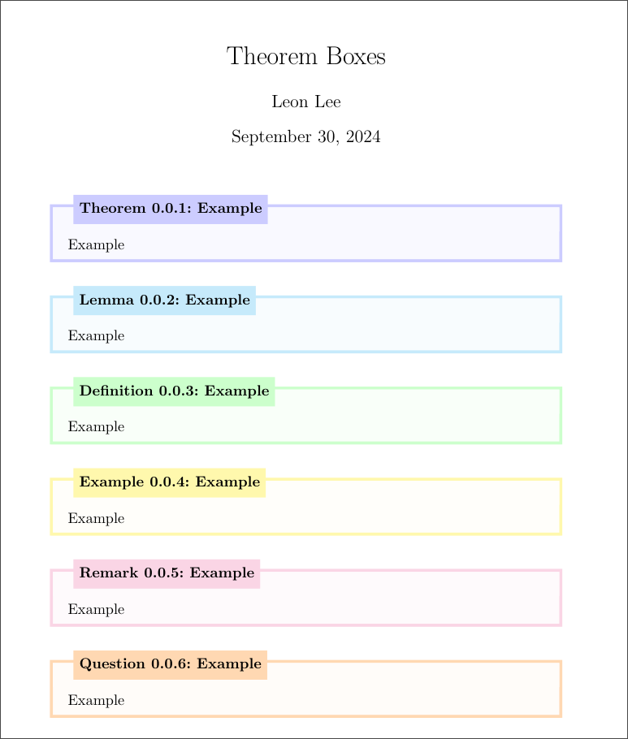

# leon-latex-thmboxes
Customisable Theorem boxes for LaTeX

Theorem boxes are created using `thmboxes_v3.sty`. They are inspired by
- [Fancy boxes with mdframed](https://texblog.org/2015/09/30/fancy-boxes-for-theorem-lemma-and-proof-with-mdframed/)
- [Manual Theorem numbering](https://tex.stackexchange.com/questions/391443/new-theorem-environment-with-manual-theorem-number)

**NOTE**: don't use thmboxes_v4, it's WIP and doesn't really work right now

## Example:

[Example file](example.tex)

## How to use
Download from Releases, or just download the file from the repo. Then import using

```
\usepackage[framemethod=TikZ]{mdframed}
\usepackage{thmboxes_v3}
```
MDFramed is used to make the actual boxes so is needed for the package to work.

Boxes are created using the following syntax:
```
\begin{Type}[Name]{Label}{Reference Number}
Text
\end{Type}
```
Where:
- Type can be your own custom ones, or the following standard types: `thm` (theorem) / `lma` (lemma) / `dfn` (definition) / `xmp` (examples) / `rem` (remark) / `qst` (Question)
- `Name` is what will be displayed after the type / number
- `Label` is for cross-document hyperlinking
- `Reference Number` is a custom text if filled. Does not have to be numeric
    - If not filled, the number follows an automatic scheme on `\subsubsection` level

:coffee: [(Optional) Buy me a coffee :)](https://ko-fi.com/leon024)

## Custom Theorem Boxes

### Generic Template
Custom boxes can be created using the following syntax:
```
% \begin{thmbox}[Name]{Label}{Reference Number}{Box Colour}{Box Opacity}{Title Category}
    % TEXT
% \end{thmbox}
```
Where like before:
- `Name` is what will be displayed after the type / number
- `Label` is for cross-document hyperlinking
- `Reference Number` is a custom text if filled. Does not have to be numeric

There are also options that are for creating the custom boxes
- `Box Colour` is the colour of the box, I use standard LaTeX colours but any library should work
- `Box Opacity` is the opacity that the border and title block is made from. The background is just set to 0.04% because it doesn't make much of a difference but feel free to change it - should just involve adding one more column
- `Title Category` is the actual text at the beginning of the title e.g. "Definition"

### Actual Repeatable Environments
The environments that should get used in the LaTeX documents don't really need options like "blue" for theorem if all theorems are blue. Solution is to make new environments, that are basically just 'thmbox' environments wrapped as another one but with the standard settings for the colours and title text. e.g.

```
\newenvironment{thm}[3][]{
    \begin{thmbox}[#1]{#2}{#3}{blue}{20}{Theorem}
} {\end{thmbox}}
```

Creates a new environment `thm` that's blue and says Theorem at the start, which you can then use like normal. Generic template for this is

```
\newenvironment{Type}[3][]{
    \begin{thmbox}[#1]{#2}{#3}{Box Colour}{Box Opacity}{Title Category}
} {\end{thmbox}}
```

Where the options are the same as listed above

## WIP
- Hopefully gonna be working on an overhaul using tcolorbox (thmboxes_v4), as there's a bug where using multicols makes it so it makes an empty page break instead of breaking onto the next column, but that probably won't be until exam season
